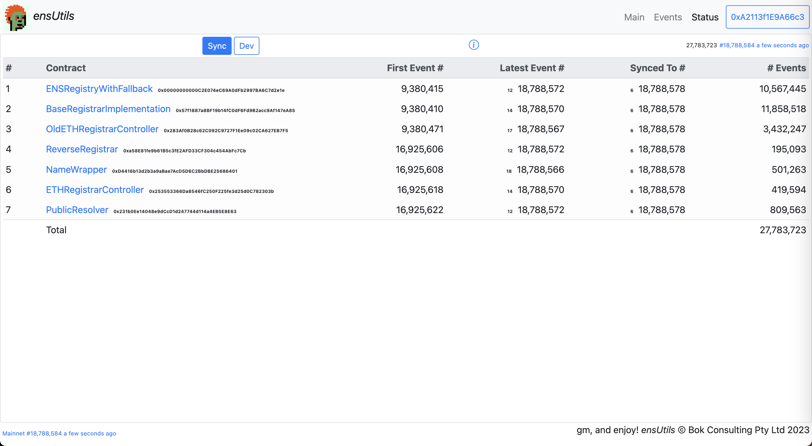

# ensUtils
ENS Utilities (work in progress)

This dapp retrieves all logged events from ENS contracts via the web3 connection and stores this information in your local browser IndexedDB storage.

Due to the large amount of logged events (27.78 million records @ Dec 15 2023), syncing this dapp takes several hours. Due the a memory leak in the call to the web3 **`getLogs(...)`** function, syncing will occur 2 million records at a time. You will have to refresh the browser after each syncing to reset the leaked memory.

web3 dapp: https://bokkypoobah.github.io/ensutils/

Or git clone this repository and use e.g. `anywhere` from the ./docs folder.

 

 

---

### Sample Screens

At Dec 15 2023, there are 27.78 million logged events in the following 7 smart contracts:

<kbd></kbd>
